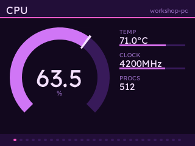
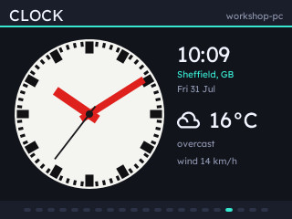

# statsbadge

Your PC's vitals on a Badgeware badge, paged with UP and DOWN. An Afterburner-style panel that is not welded to a keyboard.

 

A server on the host measures things and serves them; the badge fetches and draws them. The host also serves a web page for choosing which screens appear, so rearranging the display needs no reinstall.

## Install

Uses [uv](https://docs.astral.sh/uv/). As a tool, so it lands on your PATH and keeps its own environment:

```bash
uv tool install statsbadge
statsbadge serve
```

Working on a checkout instead:

```bash
uv sync
uv pip install --no-deps ./extensions/statsbadge-clock   # optional, the example
uv run statsbadge serve
```

Or into whatever environment you already have, with pip or uv:

```bash
uv pip install statsbadge      # or from a checkout: uv pip install .
pip install statsbadge         # plain pip works too
```

Extras, if you want them: `statsbadge[nvidia]` for NVIDIA cards via NVML, `statsbadge[install]` for pushing the app to a badge over USB, `statsbadge[all]` for both.

With the badge on USB, in another terminal:

```bash
statsbadge install                       # copies the app, extensions and pairs it
statsbadge install --ssid "My Network"   # and sets up WiFi, from a brand new badge
```

That writes the pairing secret over the serial REPL and, if the app needs copying, offers to reset the badge into USB mass storage mode to do it. Answer no and you get credentials only.

Run it again whenever you have upgraded the package or installed an extension. It compares what is on the badge with what it would put there, copies only what changed, removes what no longer belongs, and leaves the badge alone entirely when nothing has: about a second, no reset. `statsbadge update` is the same command under the name you probably reached for. Credentials it has already written are left as they are, so a repeat run is purely a code update.

`--ssid` sets the WiFi details in the badge's `secrets.py` while that volume is mounted, so a new badge goes from unboxed to showing stats in one command. It prompts for the password, so the password stays out of your shell history; `--pass` takes it directly and an empty string means an open network. `--region` and `--timezone` set those too. Details the badge already has are left alone unless you pass `--force-secrets`.

No cable? Run `statsbadge pair`, or open the config UI and press **Pair a badge**. Launch **Stats** on the badge and press **B** to set up; it finds the host by itself and shows a six-character code. Check that code matches the one the host shows, and approve it there. Nothing is typed on the badge.

A server is not in pairing mode until you put it there, and the window closes on its own after five minutes or when you press **Stop pairing**. Requests are rate limited and capped, and one only pairs a badge when you approve it.

Then open <http://127.0.0.1:8420/> to pick screens, themes and button bindings.

## Everything else you might want

```bash
statsbadge serve                       # the usual thing
statsbadge status                      # what is on the badge, what this host knows
statsbadge extensions                  # installed extensions, and whether they loaded
statsbadge probe                       # what this host can measure at all
statsbadge badges                      # which badges are paired here
statsbadge badges --forget <badge-id>

statsbadge install --force-app         # copy the app whether or not it changed
statsbadge install --no-extensions     # leave extension modules off the badge
statsbadge install --without clock     # everything except that one extension
statsbadge install --new-secret        # re-key this badge
statsbadge install --ssid "Other" --force-secrets    # change the WiFi it uses

statsbadge --config-dir ./cfg serve    # global options come before the subcommand
```

Configuration lives in `~/.config/statsbadge` on Linux, `~/Library/Application Support/statsbadge` on macOS and `%LOCALAPPDATA%\statsbadge` on Windows, or `$XDG_CONFIG_HOME/statsbadge` wherever that is set. `statsbadge status` prints the path it is using. Three files: `layout.json`, `server.json` and `badges.json`, the last holding pairing secrets and kept at mode 600.

## Changing IPs, and more than one computer

Credentials are keyed on a server id the host mints once, not on its address. So:

- **The host's IP changes.** The badge notices the polls failing, hears the host's beacon, recognises the id it is already paired with and follows it to the new address. Nothing to re-pair.
- **Two computers.** Pair with both - `statsbadge install` and `statsbadge pair` add a host rather than replacing one, each with its own secret and counter. The badge uses whichever it can reach, and switches by itself when the current one goes quiet.
- **Same computer, fresh install.** `install` reuses the existing secret unless you pass `--new-secret`, and folds an older single-host config in rather than orphaning it.

`statsbadge badges` lists what a host has paired; `--forget` drops one.

## On the badge

| Button | What it does |
| ------ | ------------ |
| UP/DOWN | previous/next page |
| A B C | whatever the host has bound them to, if anything |
| HOME | open the hosts menu |
| HOME, held | leave the app |

The hosts menu is how you switch between machines - laptop, desktop, that Linux box - and how you add another one. It rescans every time it opens, so a server you start after the app is already running turns up without a restart.

## What it reports

| Group   | Fields                                                    |
| ------- | --------------------------------------------------------- |
| `cpu`   | load, per-core, temperature, clock, load average, processes |
| `mem`   | used, total, percentage, swap                              |
| `gpu`   | load, temperature, VRAM, power, clock, fan                 |
| `net`   | up/down rate and totals, interface                         |
| `disk`  | used, total, read/write rate                               |
| `power` | battery, charging, package watts                           |
| `fans`  | RPM                                                        |
| `sys`   | host, OS, CPU name, uptime                                 |

A field the host cannot measure is `null`, and pages that need it are dropped rather than shown empty. On macOS that means temperatures: they need root, so pass `--powermetrics` if you want them and have passwordless sudo. Windows needs [LibreHardwareMonitor](https://github.com/LibreHardwareMonitor/LibreHardwareMonitor) running with its web server on for temperatures and fans. NVIDIA GPUs need `pip install statsbadge[nvidia]`.

## Page kinds and themes

Five kinds - `dial`, `bars`, `graph`, `grid`, `text` - and any field can go in any of them. Nine themes: `dark`, `light`, `mono`, `red`, `green`, `cyan`, `amber`, `blueprint`, `vapor`. Everything is drawn as vector shapes taking their colours from one table, so a theme is a palette and not a set of images.

   

## Extensions

An extension is a pip install. It adds data to the frame, and optionally badge-side code for a page the built-in kinds cannot draw:

```
pip install ./extensions/statsbadge-clock
statsbadge install
```

Badge-side modules go on by default, so installing an extension and then running `install` is all of it. `--no-extensions` leaves them off, and `--without NAME` drops one from both the frame and the badge.

That one is a worked example: a Swiss railway clock whose second hand sweeps at the badge's frame rate, plus weather from Open-Meteo, which needs no API key.



See [DEVELOPMENT.md](DEVELOPMENT.md) for how to write one.

## Security

Plain HTTP on the LAN, with every request signed HMAC-SHA256 against a shared secret from pairing, and a counter the host refuses to accept twice. So a command cannot be forged or replayed, and an unpaired device on the network learns nothing. TLS is affordable on this hardware but buys little without certificate validation - [DEVELOPMENT.md](DEVELOPMENT.md) has the measurements. The config API is bound to loopback because it can mint secrets. Host commands only run if you have bound them to a button.

## Names

The repository is `pimoroni/stats-badge`; the package, the module and the command are all `statsbadge`. Keeping those three identical is deliberate - name them differently and uv_build needs its `module-name` setting, which older uv treats as a fatal parse error rather than a warning.

## Layout

```
src/statsbadge/            the host server, a normal Python package
src/statsbadge/badge_app/  the badge app - MicroPython, runs only on the badge
src/statsbadge/web/        the config UI
extensions/                one package per extension
tools/                     host and on-badge development tools
tests/                     server, auth and framing tests
```

The badge app lives inside the package so that an installed wheel carries it and `statsbadge install` can put it on a badge with no network. It is MicroPython and is never imported on the host.

## Working on it

```bash
uv sync                                             # dev environment
uv run statsbadge probe                             # what this host can measure
uv run python tests/test_core.py                    # server, auth, framing
uv run python tools/check_app.py                    # the app parses and is whole
uv run ruff check --config ci/ruff.toml src tools tests extensions
uv build                                            # sdist + wheel into dist/
ci/build-mpy.sh                                     # precompile the badge app

mpremote connect PORT mount . run tools/probe.py    # draw every page, time it
mpremote connect PORT mount . run tools/live.py     # talk to a real server
mpremote connect PORT mount . run tools/run.py      # the whole app, uninstalled
mpremote connect PORT mount . run tools/multihost_test.py   # pairing config
mpremote connect PORT mount . run tools/failover_test.py    # a changed host IP
uv run python tools/shots.py shots                  # framebuffer dumps to PNGs
```

`statsbadge install` uses precompiled bytecode by default: CI compiles it into the package before the wheel is built, so a pip install carries both that and the `.py` sources. It loads in 66ms where the sources take 763ms, because the badge compiles at every launch. Bytecode only loads on the firmware it was built for, so if a badge runs different firmware the install falls back to the sources and says so. `--mpy DIR` installs a build of your own, `--source` forces the sources.

Releases: tag `vX.Y.Z` matching the version in `pyproject.toml` and publish a GitHub release. CI builds the wheel, checks it carries the badge app, attaches both the source and precompiled app zips, and publishes to PyPI over trusted publishing - no API token to store.

[DEVELOPMENT.md](DEVELOPMENT.md) covers how it is put together and what each frame costs. It also explains why the server writes every response in a single `write()`, which is worth 30x on this hardware.
